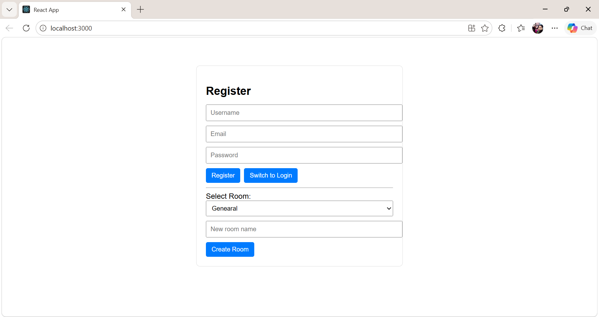
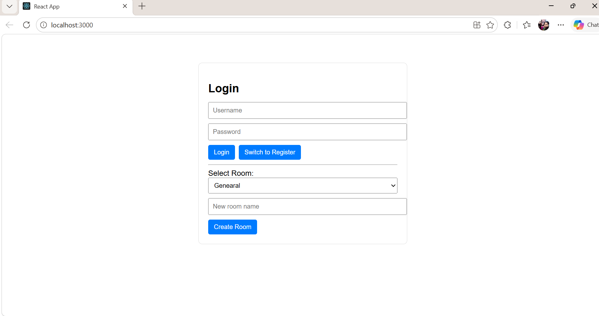
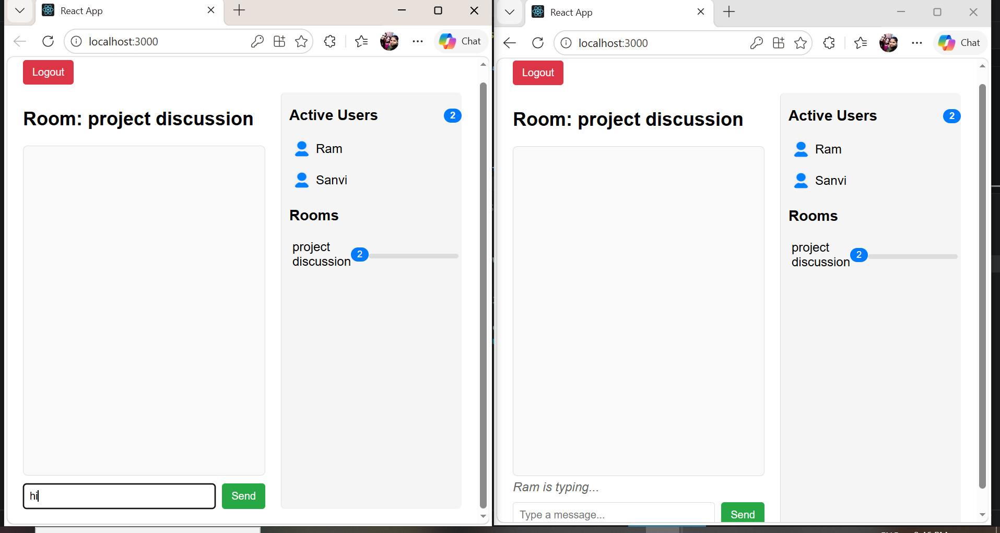
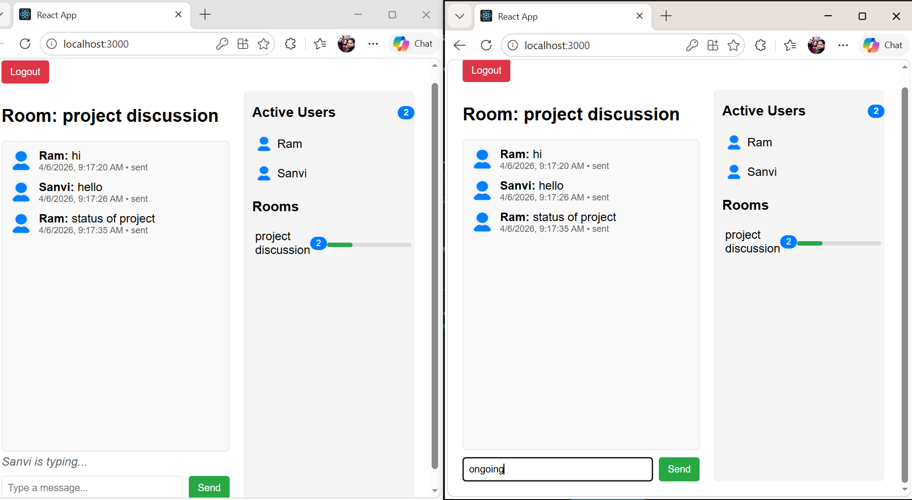

# Chat-Bot: Full-Stack Realtime Chat Application

## 📖 Overview
Chat-Bot is a full-stack realtime chat application built with **Flask (Python)** for the backend and **React** for the frontend. It uses **Socket.IO** for realtime communication and **MySQL** for persistent storage. The project demonstrates multi-user interaction, authentication, room-based messaging, and dashboard-style analytics.

## ✨ Features
- 🔐 User authentication (register/login)
- 💬 Realtime messaging with Socket.IO
- 🏠 Room selection and room-specific history
- 👥 Active user sidebar with live presence tracking
- 📊 Room statistics and message volume graphs
- ⌨️ Typing indicators for realistic chat experience
- 🗄️ MySQL database integration for persistent storage

## 📂 Project Structure
chat-bot/
├── backend/                 # Flask + Socket.IO + MySQL backend
│   ├── app.py
│   ├── models.py
│   ├── requirements.txt
│   └── test_socket.py
│
├── frontend/                # React frontend
│   ├── public/
│   │   ├── default-avatar.png
│   │   ├── favicon.ico
│   │   ├── index.html
│   │   ├── logo192.png
│   │   ├── logo512.png
│   │   ├── manifest.json
│   │   └── robots.txt
│   ├── src/
│   │   ├── App.css
│   │   ├── App.js
│   │   ├── App.test.js
│   │   ├── ChatBox.js
│   │   ├── index.css
│   │   ├── index.js
│   │   ├── logo.svg
│   │   ├── reportWebVitals.js
│   │   └── setupTests.js
│   ├── package.json
│   └── package-lock.json
│
├── database/                # SQL schema and migrations
│   └── schema.sql
│
├── Screenshots/             # Demo screenshots
│   ├── dashboard.png
│   ├── login.png
│   ├── register.png
│   └── typeindicator.png
│
├── README.md                # Project documentation
└── .gitignore               # Ignore rules (frontend + backend)


## ⚙️ Setup Instructions

### Backend (Flask)
1. Navigate to the backend folder:
   ```bash
   cd backend

2. Create and activate a virtual environment:
   ```bash
   python -m venv my3env
   source my3env/bin/activate   # Linux/Mac
   my3env\Scripts\activate      # Windows

4. Install dependencies:
   ```bash
   pip install -r requirements.txt

6. Run the Flask server:
   ```bash
   python app.py

### Frontend (React)
1. Navigate to the frontend folder:
   ```bash
   cd frontend

3. Install dependencies:
   ```bash
   npm install

5. Start the React development server:
   ```bash
   npm start

7. Open http://localhost:3000 in your browser. 

## 🖼️ Screenshots








## 📊 Demo Highlights
- Multiple users chatting simultaneously
- Room-based statistics and analytics
- Dashboard-style UI with active user tracking

## 📜 License
MIT License

Copyright (c) 2026 [Your Name]

Permission is hereby granted, free of charge, to any person obtaining a copy
of this software and associated documentation files (the "Software"), to deal
in the Software without restriction, including without limitation the rights
to use, copy, modify, merge, publish, distribute, sublicense, and/or sell
copies of the Software, and to permit persons to whom the Software is
furnished to do so, subject to the following conditions:

The above copyright notice and this permission notice shall be included in all
copies or substantial portions of the Software.

THE SOFTWARE IS PROVIDED "AS IS", WITHOUT WARRANTY OF ANY KIND, EXPRESS OR
IMPLIED, INCLUDING BUT NOT LIMITED TO THE WARRANTIES OF MERCHANTABILITY,
FITNESS FOR A PARTICULAR PURPOSE AND NONINFRINGEMENT. IN NO EVENT SHALL THE
AUTHORS OR COPYRIGHT HOLDERS BE LIABLE FOR ANY CLAIM, DAMAGES OR OTHER
LIABILITY, WHETHER IN AN ACTION OF CONTRACT, TORT OR OTHERWISE, ARISING FROM,
OUT OF OR IN CONNECTION WITH THE SOFTWARE OR THE USE OR OTHER DEALINGS IN THE
SOFTWARE.

## 🙌 Acknowledgements
- [Flask](https://flask.palletsprojects.com/)
- [React](https://reactjs.org/)
- [Socket.IO](https://socket.io/)
- [MySQL](https://www.mysql.com/)
